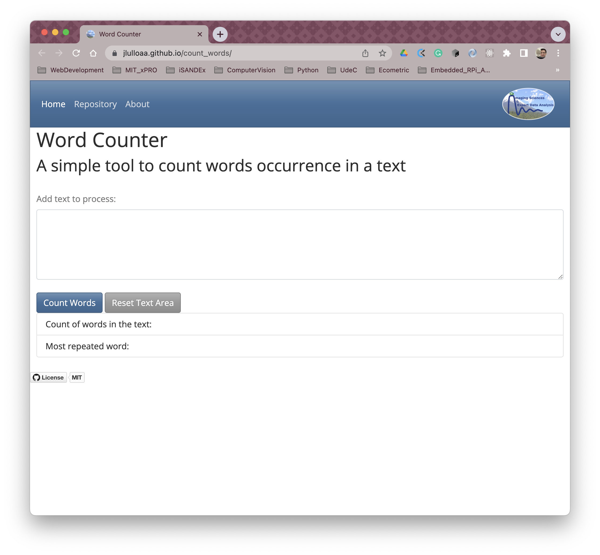

<h1 align="center">
    Word counter
   
</h1>
<h2 align="center">Simple app to count words in a text</h2>

  
  
  
  

  <a href="#description">Description</a>
  <a href="#how-to-run">How To Run</a>
  <a href="#roadmap-of-future-improvements">What's next?</a>
  <a href="#contributing">Contributing</a>
  <a href="#credits">Credits</a>
  <a href="#license-information">License</a>

# :open_book: Description
Word Counter is a very simple application to count words in a text. It does not only count the number of words, but also provide a list with the most repeated words in the text. It is useful to identify possible redundancies within the text. 

This application is useful to support grant/fundins applications, abstract submissions, or an other publication where sections are limited to a maximum number of words.

This is a work in progress, so there is a lot functionalities that can be added :thinking:

# How to Run
Step-by-step guide to use the app...

<h2 align=center> <a href="https://jlulloaa.github.io/count_words">:scroll: Play with the app to count words :books: </a> </h2>

# Roadmap of future improvements
* Add the option to count characters with/without spaces
* Add some intelligence to provide synonyms to highgly repeated words (it requires language support, either manual or automatic)
* Language support, in principle, it can be manually selected from a drop-down list
* Treat words written in capital and small letters as the same (currently, *"Hello"* and *"hello"* are counted as different words)
* ...

# Contributing
Pull requests are welcome, and I'll be happy to chat about any improvement or extension that could be donde to this app.

# Credits
This software uses the following third party tools:

# License information
This project is licensed under the terms of <a href="https://github.com/jlulloaa/eyes/blob/main/LICENSE" target="_blank"> MIT license </a>
